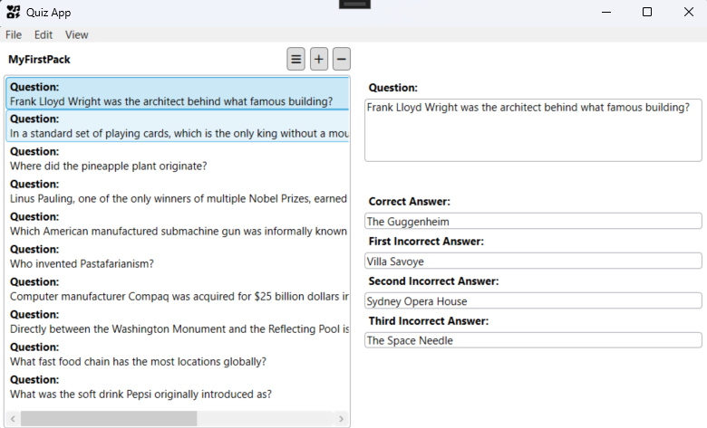
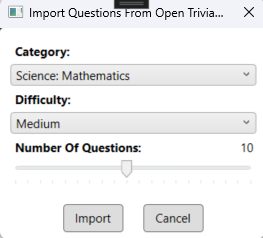
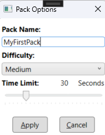
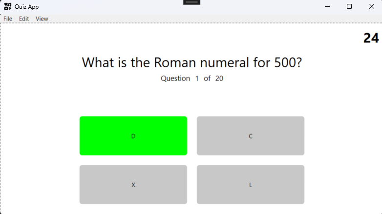
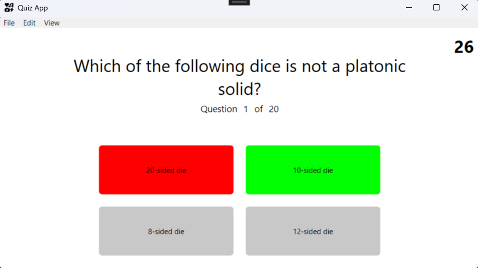
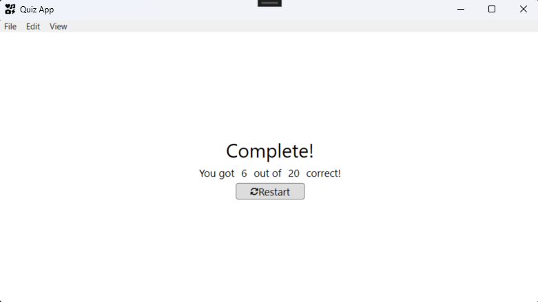

# Labb3-GUI
Third and final assignment of the C# programming course in the .NET development program at IT-Högskolan.
The task is to create a quiz app in WPF using the MVVM architectural pattern.

### Technologies and patterns used
- C#
- WPF (Windows Presentation Foundation)
- Fetching data from a RESTful public API
- Data storage in JSON format
- MVVM design pattern

## Application overview
Design your own quizzes. You can either create everything by yourself or download questions and modify.  

Import quizzez from Open Trivia Database public RESTful API. Manage your quizzes by changing name of the quiz, 
setting difficulty and time limit per question. 

 
 
Play your quizzes! Answer the quiestion within set time limit. The answeres and quiestions are set in random order. Get distinct feedback if your
answer is correct or not with color coding.

See your score after all quiestions are answered. You can choose to replay if you want to give the quiz another chance.  

## Installation
Just clone the repository and you are good to go! The app will automatically set up a directory in your local application data special folder for data storage.

## Implementation of MVVM
I have tried my best to adhere strictly to the MVVM pattern and separate the Viewmodel from the View and the Model from the Viewmodel. 
There is no logic in the code-behinds, and I have tried to minimize the code in them. However, I do have one opening/closing event that triggers commands in the ViewModel, and the code-behind of each dialog contains an OK/Cancel button click event.

### Use of Dialog Windows
There seem to be thousands of ways and no real best practice when implementing dialog windows in the MVVM pattern.
After much consideration, I chose to go with what's called a dialog service. 
I created a separate class, implementing an interface, that handles the communication with the dialog window through bindings.
Then I inject the class handling the dialog when creating a new instance of the ViewModel. 
That way, the ViewModel is only dependent on the abstraction of a class implementing the interface, with one method returning an instance of the QuestionPackViewModel class.
If I decided to write automated tests for the app, I would only have to create a mock class implementing the interface and inject that instead of the dialog service class.